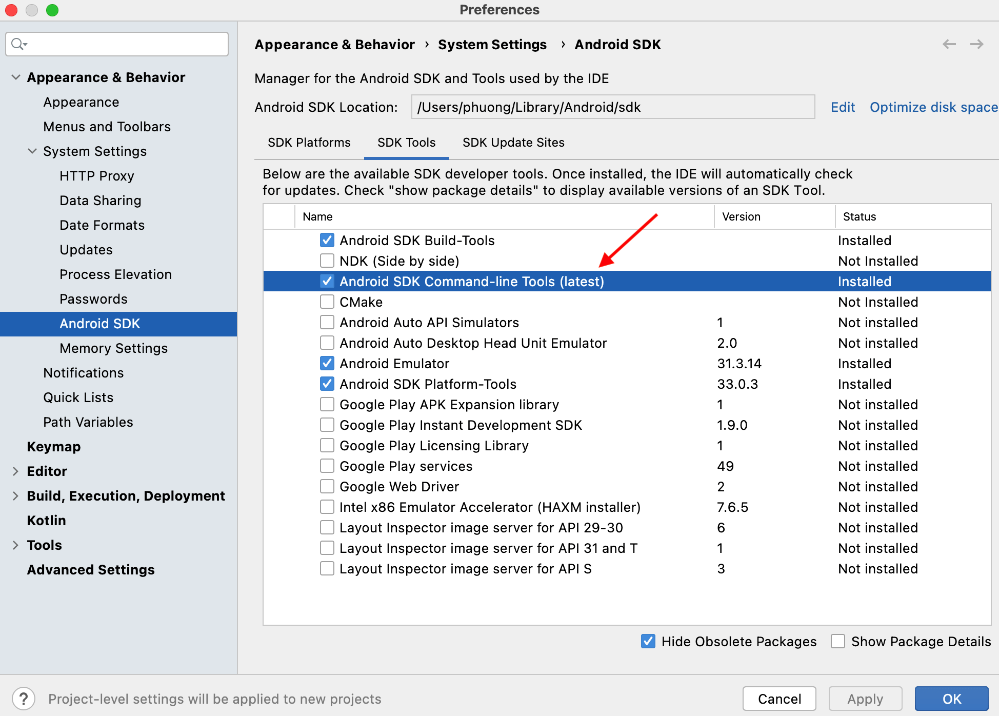
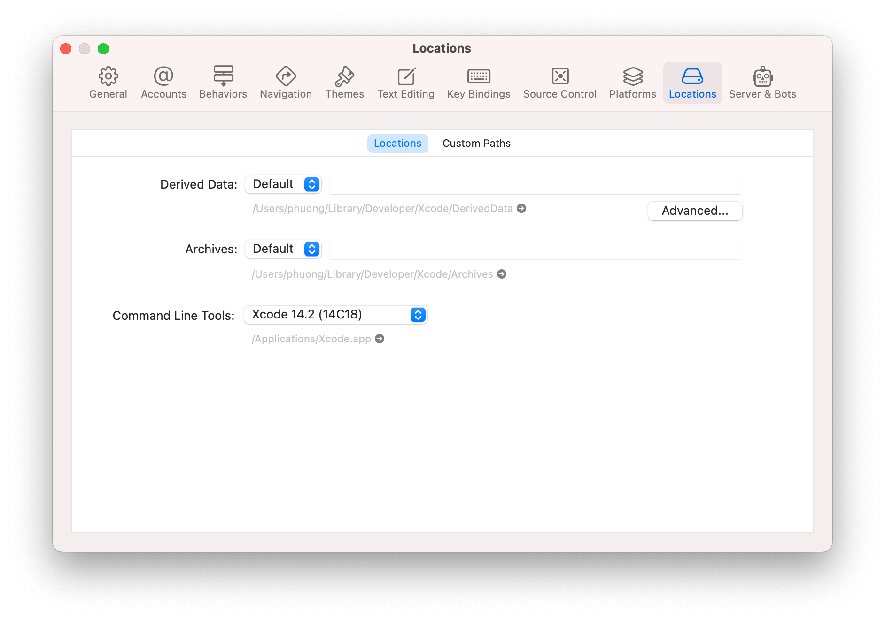

# Installation

You will need Node, the React Native command line interface, a JDK, and Android Studio.

### Clone Project

First, you need clone project from **[this repo](https://github.com/KOD-dev/mediex-app)**

### NodeJS

If you go to the terminal and type the command:

```shell
node --version
```

Then if it gives an error or no version appears, please [Download NodeJS](https://nodejs.org/en/download/) and install it.

### Android Development

#### 1. Java Development
React Native currently recommends version 11 of the Java SE Development Kit (JDK). You may encounter problems using higher JDK versions. You may download and install [OpenJDK](http://openjdk.java.net) from [AdoptOpenJDK](https://adoptopenjdk.net/) or your system packager.

#### 2. Android Studio

Make sure you have Android Studio installed before running the project. If you haven't downloaded it, please download it at [this link](https://developer.android.com/studio) and install it.

Check Android SDK in Setting(**Android Studio -> Setting -> Appearance & Behavior -> System Settings -> Android Sdk**) switch to **SDK Tools** tab and make sure you have **Android SDK Command-line Tools** checked. Then click Apply.



#### 3. Configure the environment variable

The React Native tools require some environment variables to be set up in order to build apps with native code.

```shell
nano ~/.zshrc
```

Then add the following lines to the end of file:
- Java configuration
Open new terminal and check java version folder: 

```shell
ls /Library/Java/JavaVirtualMachines/
```

And copy name of folder you want to make it to `JAVA_HOME` (example: `jdk-17.0.5.jdk`) then back to editor of `~/.zshrc` and add following line:

```shell
export JAVA_HOME=/Library/Java/JavaVirtualMachines/jdk-17.0.5.jdk/Contents/Home
export PATH=$PATH:/$JAVA_HOME/bin
```
> Note: Please change `jdk-17.0.5.jdk` to you name of folder you want make to JAVA_HOME

- Android configuration :

```shell
export ANDROID_SDK_ROOT=$HOME/Library/Android/sdk
export PATH=$PATH:$ANDROID_SDK_ROOT/emulator
export PATH=$PATH:$ANDROID_SDK_ROOT/tools
export PATH=$PATH:$ANDROID_SDK_ROOT/tools/bin
export PATH=$PATH:$ANDROID_SDK_ROOT/platform-tools
```

### Watchman

Follow the [Watchman installation guide](https://facebook.github.io/watchman/docs/install/#buildinstall) to compile and install Watchman from source.

> [Watchman](https://facebook.github.io/watchman/docs/install/) is a tool by Facebook for watching changes in the filesystem. It is highly recommended you install it for better performance and increased compatibility in certain edge cases (translation: you may be able to get by without installing this, but your mileage may vary; installing this now may save you from a headache later).

### React Native Command Line Interface

React Native has a built-in command line interface. Rather than install and manage a specific version of the CLI globally, we recommend you access the current version at runtime using `npx`, which ships with Node.js. With `npx react-native <command>`, the current stable version of the CLI will be downloaded and executed at the time the command is run.

### IOS Development 

The easiest way to install Xcode is via the [Mac App Store](https://itunes.apple.com/us/app/xcode/id497799835?mt=12). Installing Xcode will also install the iOS Simulator and all the necessary tools to build your iOS app.

If you have already installed Xcode on your system, make sure it is version 13 or newer.

#### Command Line Tools

You will also need to install the Xcode Command Line Tools. Open Xcode, then choose "Preferences..." from the Xcode menu. Go to the Locations panel and install the tools by selecting the most recent version in the Command Line Tools dropdown.



#### Installing an iOS Simulator in Xcode

To install a simulator, open <strong>Xcode > Preferences...</strong> and select the <strong>Components</strong> tab. Select a simulator with the corresponding version of iOS you wish to use.

#### CocoaPods

[CocoaPods](https://cocoapods.org/) is one of the dependency management system available for iOS. It is built with Ruby and you can install it using the version of Ruby you configured with in the previous steps.

For more information, please visit [CocoaPods Getting Started guide](https://guides.cocoapods.org/using/getting-started.html).

### Fastlane
This project use [Fastlane](https://docs.fastlane.tools/) to deployments

Install fastlane with command (Make sure you install [Homebrew](https://brew.sh/)):
```shell
brew install fastlane
```

Install `imagemagick` to handle badge
```shell
brew install imagemagick
```

### That's it!
Congratulations! You've successfully run and modified `mediex` app.