# Create Treatment

This is a function that allows you to book an appointment with a `doctor` and `receive medicine` from the clinic you want

On the app's home screen, you can make a reservation by doing the following:

| [Treatment Start ](https://xd.adobe.com/view/875c8332-efdb-4b60-8e40-51e00e7928e7-d20f/screen/744046a8-0311-4119-a223-db154b70ef80/) | [Treatment Pick Child](https://xd.adobe.com/view/875c8332-efdb-4b60-8e40-51e00e7928e7-d20f/screen/433f412a-eb78-468e-bf03-fffb703b0ef1/) |
| :-: | :-: |
| 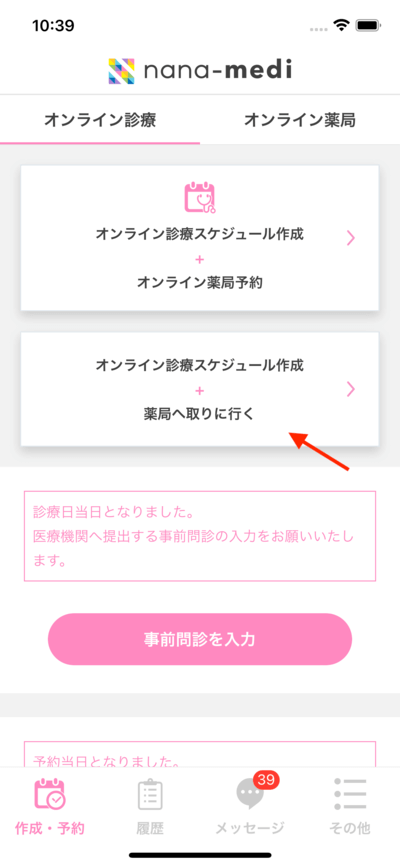 | 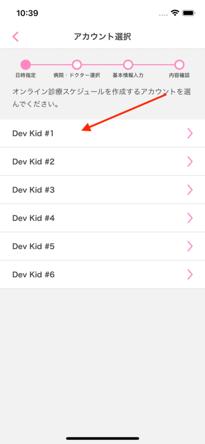 |

> If you only have one child you after you click `Treatment Start` you'll go to the [Time Picker screen](#time-picker)

In case you have more than one you will go to the `Treatment Pick Child` and select the child that will be made reservation:

## Time Picker

| [Date Picker](https://xd.adobe.com/view/875c8332-efdb-4b60-8e40-51e00e7928e7-d20f/screen/744046a8-0311-4119-a223-db154b70ef80/) | [Date Picker Popup](https://xd.adobe.com/view/875c8332-efdb-4b60-8e40-51e00e7928e7-d20f/screen/a6612aa6-5cb1-462b-94f6-ef4a97861128/) |
| :-: | :-: |
| 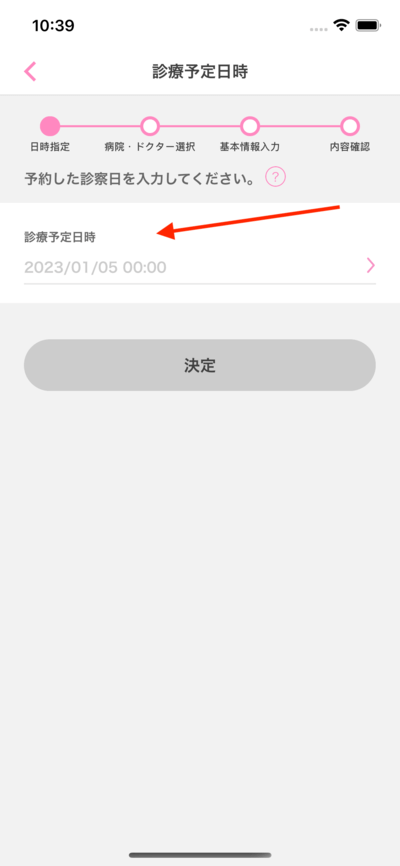 | 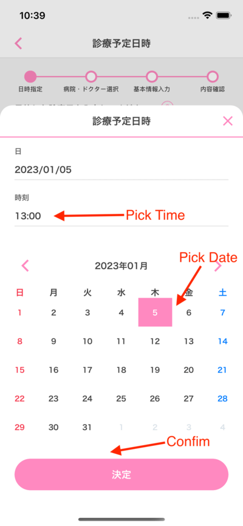 |

After pressing the confirm button, if you have [made a reservation earlier on the same day](https://redmine.codecomplete.jp/issues/29354) as the pick up date, it will show the error below and you have to re-select the date and time, otherwise it will continue to the [Select Hospital & Doctor](#select-hospital--doctor) screen.

| [Error Before Start Time](https://xd.adobe.com/view/875c8332-efdb-4b60-8e40-51e00e7928e7-d20f/screen/6fc074e9-d539-4a0a-a6c0-17bccc92c4c9) | [Error After Start Time](https://xd.adobe.com/view/875c8332-efdb-4b60-8e40-51e00e7928e7-d20f/screen/0658de88-2d20-4661-8b3e-c58f44614c2d/) |
| :-: | :-: |
| 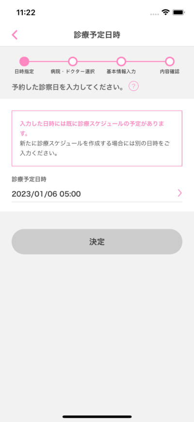 | 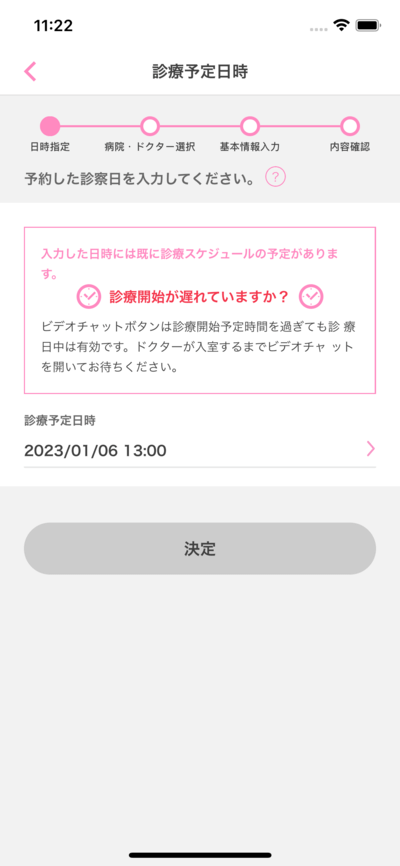 |

## Select Hospital & Doctor

We need to enter the hospital and doctor to be able to make the reservation. With the hospital we will be able to choose with 3 modes:

- Favorite hospital (when you select favorite hospital the information in the `Hospital & Doctor` screen will be filled with hospital, doctor & ticket number).
- Search hospital name with text.
- Search hospital name with location.

| [Hospital & Doctor](https://xd.adobe.com/view/875c8332-efdb-4b60-8e40-51e00e7928e7-d20f/screen/9c5a0781-a564-4f02-b97e-2a1d4152218f/) | [Pick Hospital](https://xd.adobe.com/view/875c8332-efdb-4b60-8e40-51e00e7928e7-d20f/screen/481da3e9-40c3-444b-a35a-d9dfb63fa1ee/) |
| :-: | :-: |
| 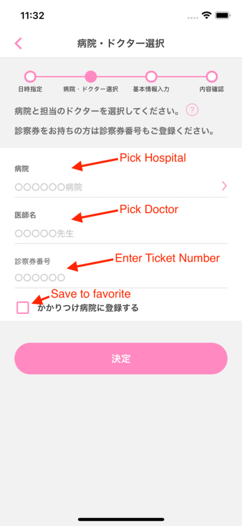 | 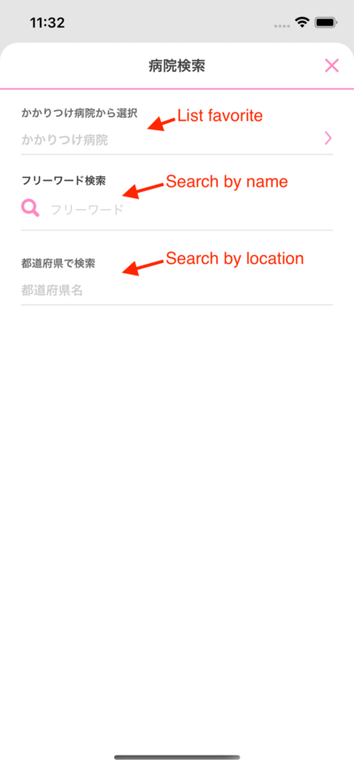 |

| [Pick Doctor](https://xd.adobe.com/view/875c8332-efdb-4b60-8e40-51e00e7928e7-d20f/screen/079279a8-f3d7-4d7e-9c55-f0c34ef7f4f9/) | [Submit](https://xd.adobe.com/view/875c8332-efdb-4b60-8e40-51e00e7928e7-d20f/screen/9c5a0781-a564-4f02-b97e-2a1d4152218f/) |
| :-: | :-: |
| 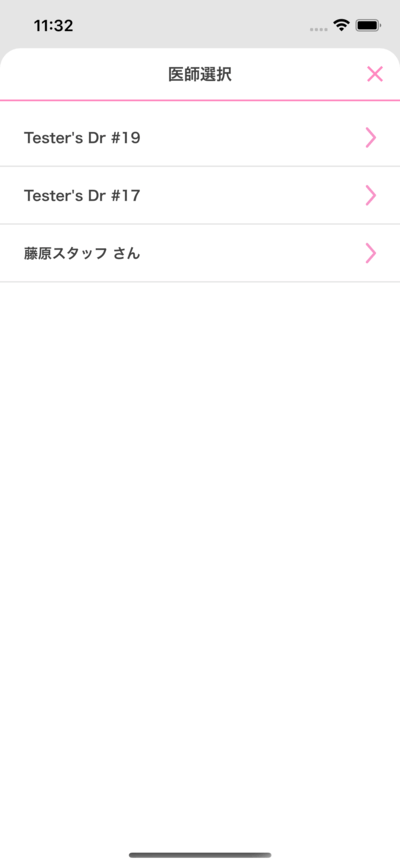 | 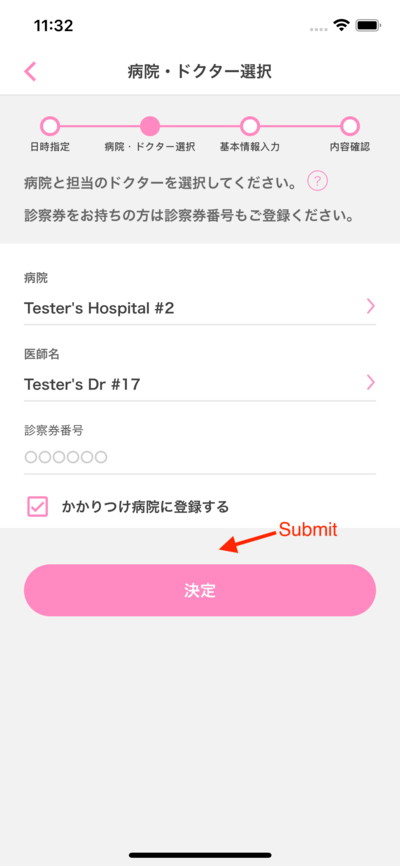 |

## Prescription

### Treatment & Guidance Prescription

| [Prescription](https://xd.adobe.com/view/875c8332-efdb-4b60-8e40-51e00e7928e7-d20f/screen/ae15c8d9-3528-4b60-b33c-cafc15d66e79/) |
| :-: |
| 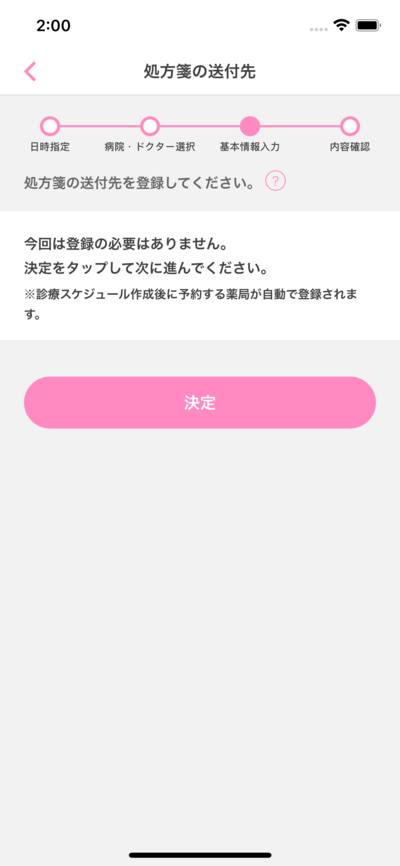 |

### Treatment only Prescription

| [Prescription](https://xd.adobe.com/view/875c8332-efdb-4b60-8e40-51e00e7928e7-d20f/screen/3096438c-8d7b-4198-8dd0-afd515c10295/) | [List Save Prescription](https://xd.adobe.com/view/875c8332-efdb-4b60-8e40-51e00e7928e7-d20f/screen/7e23018d-41e9-496e-bfc2-07fe01fe7559/) |
| :-: | :-: |
| 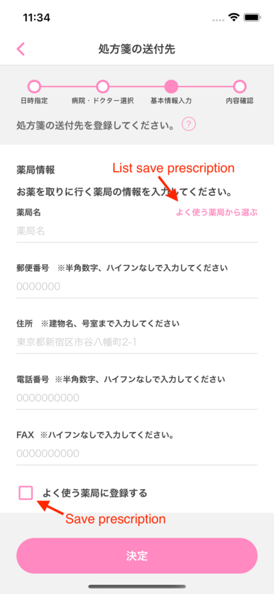 | 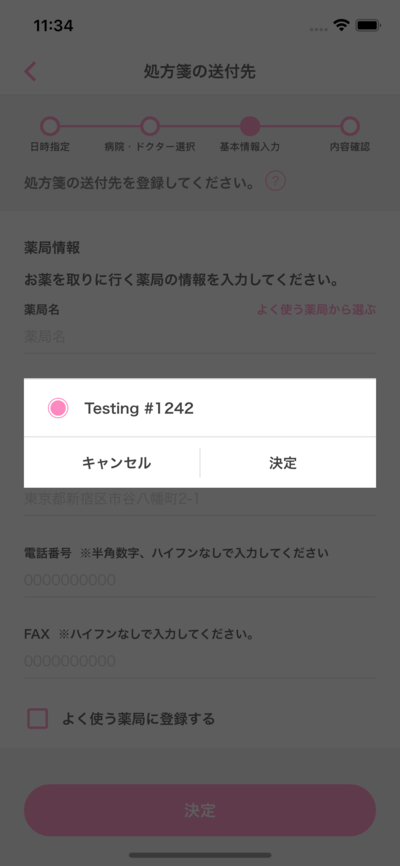 |

After you confirm prescription. If you are missing the following you will be moved to the corresponding screen:

- Lack of **[Insurance Card](#insurance-card)**
- Missing **[Medical tickets](#medical-tickets)** (You can skip by pressing Submit in this level)
- Lack of **[Payment Card](#payment-cards)**

After you have enough information, we will proceed to the Review Treatment screen

## Insurance Card

| [Insurance Card](https://xd.adobe.com/view/875c8332-efdb-4b60-8e40-51e00e7928e7-d20f/screen/a4a67401-3647-47be-8563-37dbe5c3d043/) | [Insurance Card Filled](https://xd.adobe.com/view/875c8332-efdb-4b60-8e40-51e00e7928e7-d20f/screen/a4a67401-3647-47be-8563-37dbe5c3d043/) |
| :-: | :-: |
| 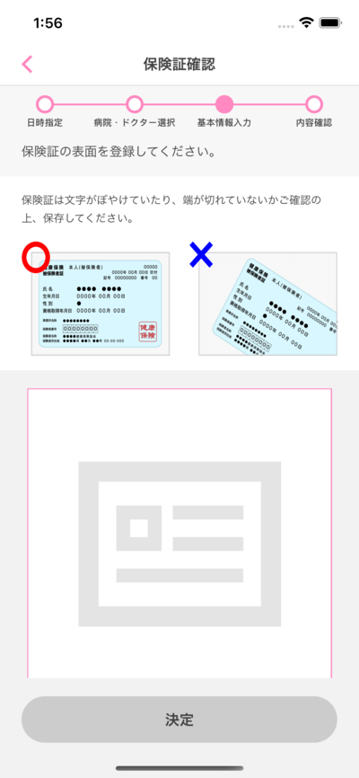 | 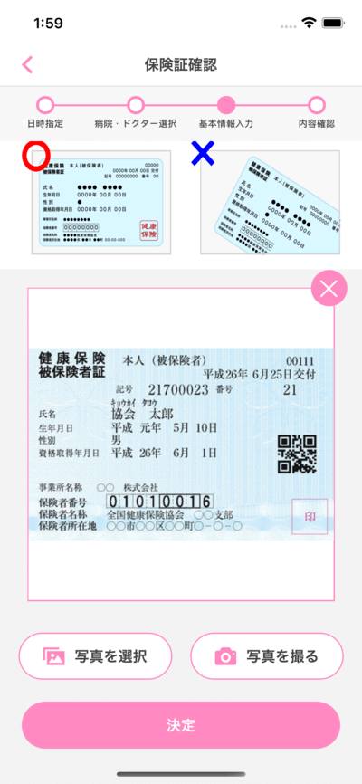 |

## Medical Tickets

| [Medical Tickets](https://xd.adobe.com/view/875c8332-efdb-4b60-8e40-51e00e7928e7-d20f/screen/6042f620-0eed-4f34-9850-65d259b744ee/) | [Medical Tickets Filled](https://xd.adobe.com/view/875c8332-efdb-4b60-8e40-51e00e7928e7-d20f/screen/6042f620-0eed-4f34-9850-65d259b744ee/) |
| :-: | :-: |
| 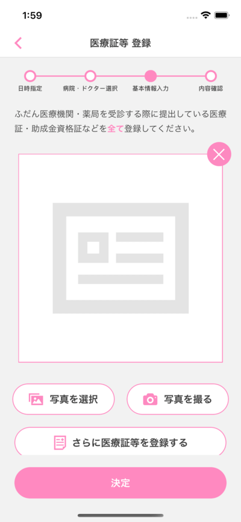 | 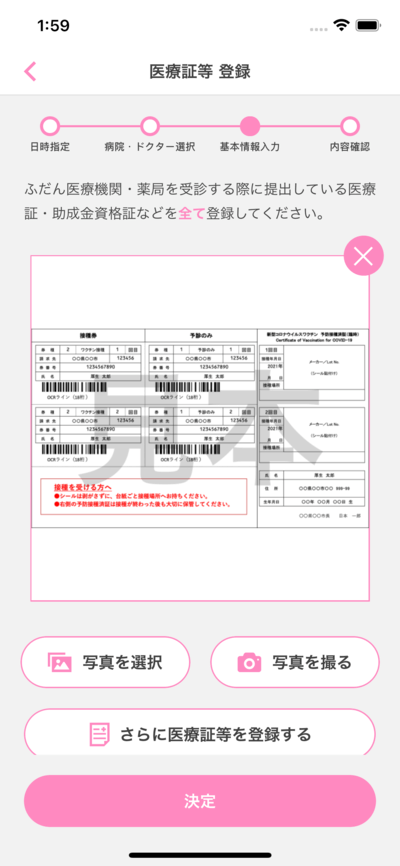 |

## Payment Cards

## Review Treatment

| [Review Treatment](https://xd.adobe.com/view/875c8332-efdb-4b60-8e40-51e00e7928e7-d20f/screen/62a8e3f0-bbef-489a-b249-cf035c1bb4d0/) | [Review Treatment Other Info](https://xd.adobe.com/view/875c8332-efdb-4b60-8e40-51e00e7928e7-d20f/screen/62a8e3f0-bbef-489a-b249-cf035c1bb4d0/) |
| :-: | :-: |
| 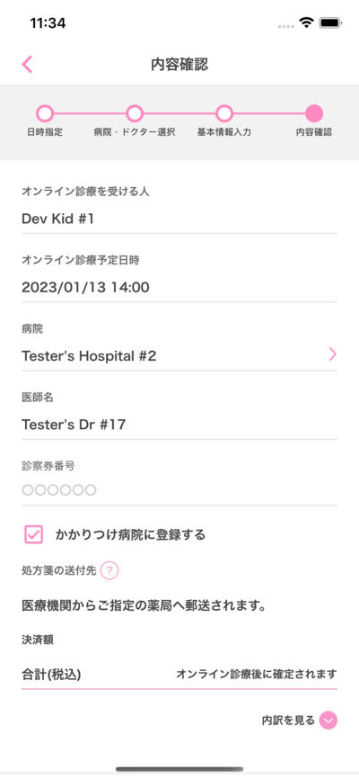 | 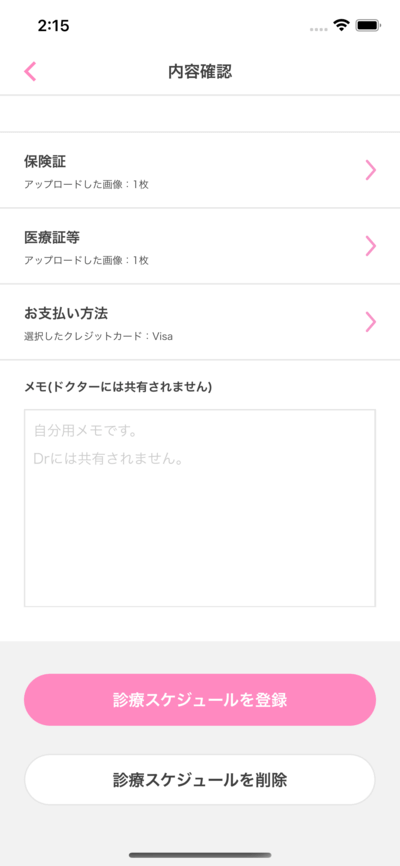 |

## Create Treatment Success

| [Create Treatment & Guidance Success ✅](https://xd.adobe.com/view/875c8332-efdb-4b60-8e40-51e00e7928e7-d20f/screen/1954a49f-b657-46d9-9a8b-663bda0e7b2c/) | [Create Treatment Only Success ✅](https://xd.adobe.com/view/875c8332-efdb-4b60-8e40-51e00e7928e7-d20f/) |
| :-: | :-: |
| 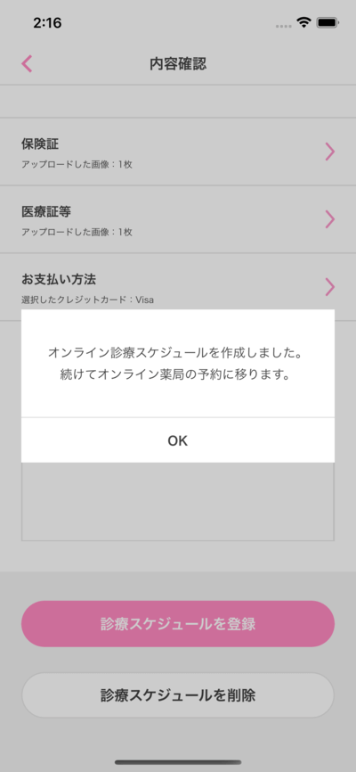 | 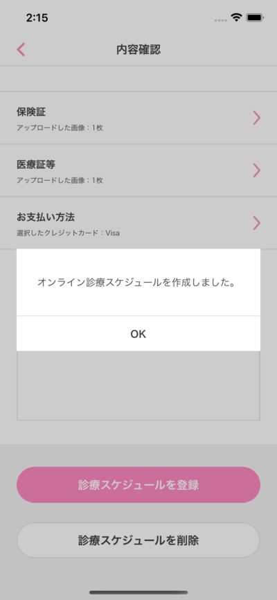 |
